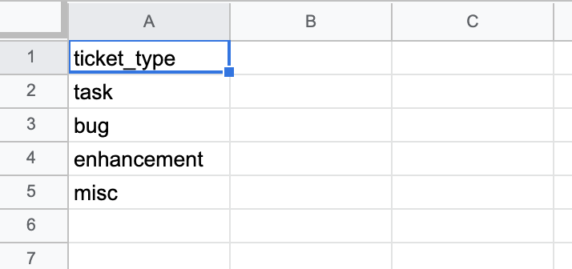
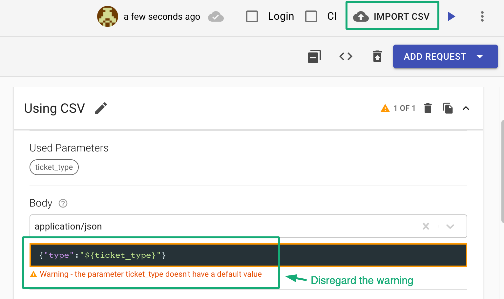

# API Testing FAQs

### I've got a JSON response where I want to extract all book titles from the array by using JSON Path expression - $.store.book\[\*].title but I'm getting only the first title. WHY?

Loadmill uses a framework where only the first value gets retrieved in case you are using the \* sign. Use the [`__jsonpath_all`](https://docs.loadmill.com/api-testing/test-suite-editor/functions#\_\_jsonpath\_all-target-jsonpath-default) function instead so your extractions will look this way:

### **I'm testing entity creation where entity Name should be unique. Can I assign a set of random letters to it?**

Sure, create a parameter with using the `__random_letters([length=10])` function for that:

Find more great functions on [this page](https://docs.loadmill.com/api-testing/test-suite-editor/functions#randomization-functions) and more information about default parameters [here](https://docs.loadmill.com/api-testing/test-suite-editor/test-suite-parameters).

### **I'm getting ID of my resource and I want to make sure it is in the format of UUID. How can I do that?**

You can easily achieve that:

1. Extract the ID into a parameter by using JSONPath.
2. Create another parameter by using the extracted ID and [function `__random_uuid()`](https://docs.loadmill.com/api-testing/test-suite-editor/functions#\_\_random\_uuid). The output would be "true" if the ID is in the format of UUID. Else, it would be "false".

3\. Now, assert the second parameter you've created earlier.

### Is there a way to run an API test with a combination of values? In my case, I want to create tickets where each ticket has a specific type, there are 10 ticket types available.

There is a feature in Loadmill that allows to do that. First, create a CSV file containing all ticket types, like below:

Then, go to Loadmill, upload the file by using the "Import CSV" button within a test flow and use the "ticket\_type" parameter in your request body:

Thus, when running the Test Suite, each test iteration will get a relevant ticket type from the CSV file. Find more information about using CSV files in API tests [here](https://docs.loadmill.com/api-testing/test-suite-editor/api-tests-data-from-csv-files).

###
