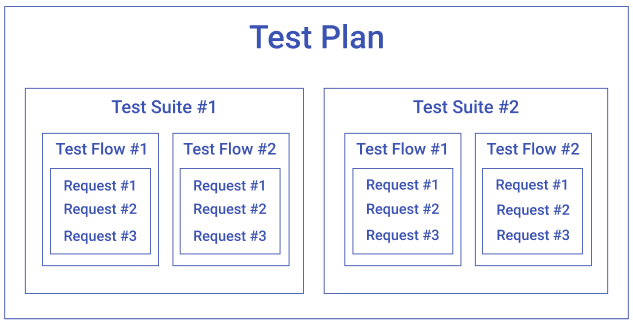
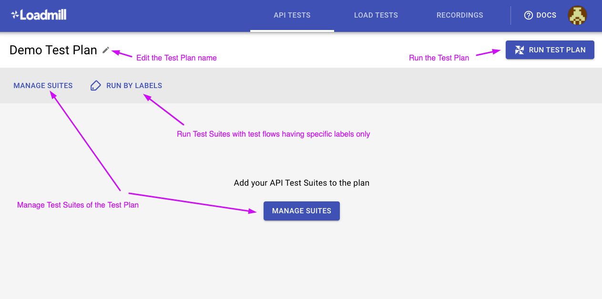
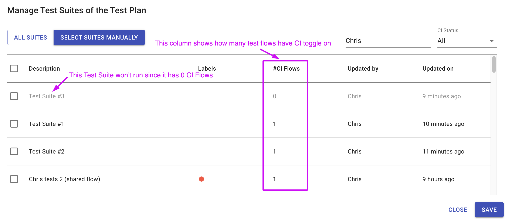
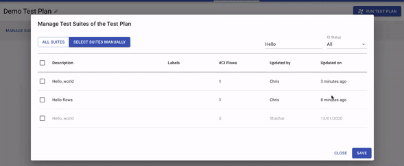
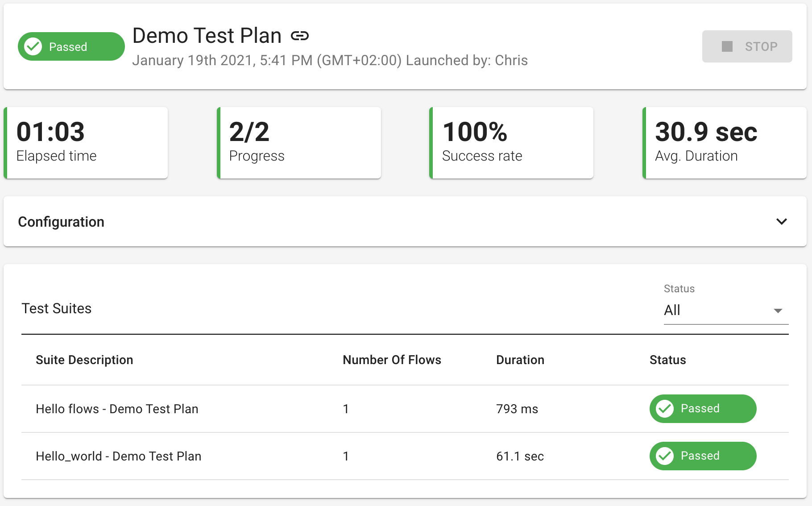

# Test Plan

A Test Plan is a collection of Test Suites that belong to specific tasks or features or have another reason to be run together. In general, the primary use of Test Plans is running several Test Suites integrated into your Continuous Delivery pipeline, although you may still run it manually in the UI.

The image below shows the Test Plan hierarchy in Loadmill. 

### Creating and running a Test Plan

Let's create and run your first Test Plan together:

1. Navigate to the Test Plans tab and click on the "NEW TEST PLAN" button.
2. Let's look at the Test Plan editor page.

   3. Click on "MANAGE SUITES" to add Test Suites to the Test Plan. You can select all Test Suites or specific ones by clicking "SELECT SUITES MANUALLY". Once the Test Suites are selected, click "Save".


🧠 Make sure that the Test Suites you would like to run within the Test Plan have test flows with CI toggle on. Otherwise, the Test Suites will be shown as grayed out and won't run. 


 4. Now you have two options:

* Run the Test Plan by clicking “RUN TEST PLAN”  
* Use the "RUN BY LABELS" option to select relevant labels and then click “RUN TEST PLAN” so that only Test Suites whose test flows have specific labels will run.

### Analyzing Test Plan results

After running the Test Plan, you will be redirected to the Test Plan Run page. The Test Plan Run report page shows the list of executed Test Suites as defined in the Test Plan. The Test Suites table shows **each suite's description, the number of its flows, duration, and status**. Use the table filter to filter the flows by their status.

