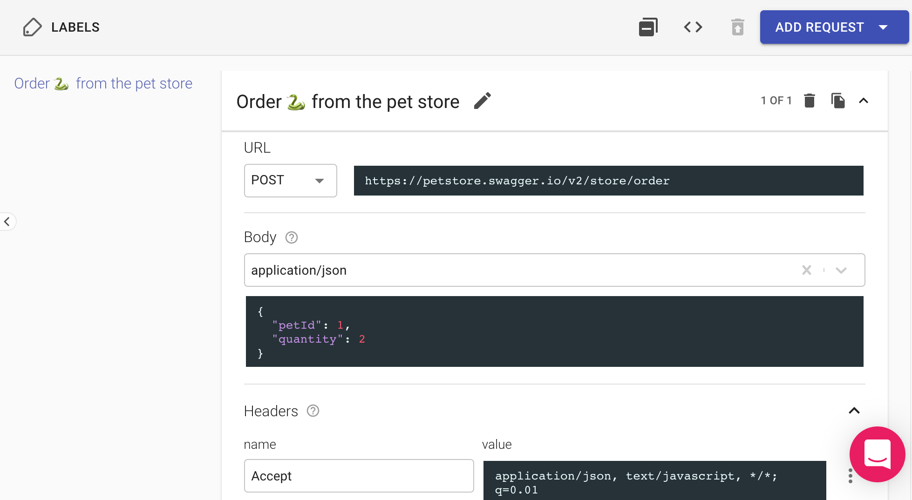
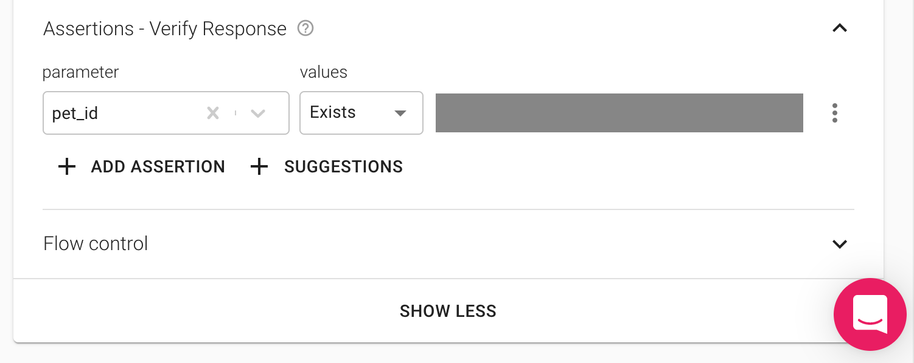

# Request editor

Request is the most basic building block of tests. It represents a single API call or a user action.

## Request sections

When we expand the request editor by clicking at the top-right of the request, we can see that a test request includes two main sections - **Request and Response Handling sections**.

### The Request Handling section

* The **Method** and **URL** fields are the most basic requirements for a valid request.
* Black input fields are fields in which you can use [parameters](https://docs.loadmill.com/api-testing/test-suite-editor/parameters) and [functions](https://docs.loadmill.com/api-testing/test-suite-editor/parameters/functions).
* It is recommended to set the Request description in a way that describes its action. This will make it easier for you to debug your tests later if this request fails.
* Some requests require a **body**. Selecting the right **content-type** for your request will help us highlight the syntax of your request body (i.e. JSON or XML).
* The **Headers** section allows to see and set the request headers. You can add header to all requests or as a Global Header so that it will be added to all of the test flow requests and appear in [the Global Login tab](https://docs.loadmill.com/api-testing/test-suite-editor/global-login-flow).

### The Response Handling section

The response handling section includes 3 sections: [**Extractions - Set Parameters**](https://docs.loadmill.com/api-testing/test-suite-editor/set-parameters-extractions), [**Postscript - run code**](https://docs.loadmill.com/api-testing/test-suite-editor/postscript-run-code) (disabled by default), [**Assertions - Verify Response**](https://docs.loadmill.com/api-testing/test-suite-editor/assertions) and Flow control.&#x20;

#### The **Extractions - Set Parameters** section allows you:

* To extract values from the response body into an existing or a new parameter using JSONPath, Closure, jQuery, RegExp.
* To extract an HTTP header value into a parameter using the Header extractor.
* To assign a static value or [**apply a function on another parameter**](https://docs.loadmill.com/api-testing/test-suite-editor/functions) using the "Assign" option.
* To add an extraction from [the Suggestions repository](https://docs.loadmill.com/api-testing/test-suite-editor/set-parameters-extractions#suggestions). Team admins configure the repository within Settings - Suggestions.

The **Assertions - Verify Response** section allows you to validate the request response.

The **Flow Control** section allows to repeat the request until the parameter's value meets the requirement or number of iteration reached:

You can also set Skip and Stop conditions between requests within this section:

