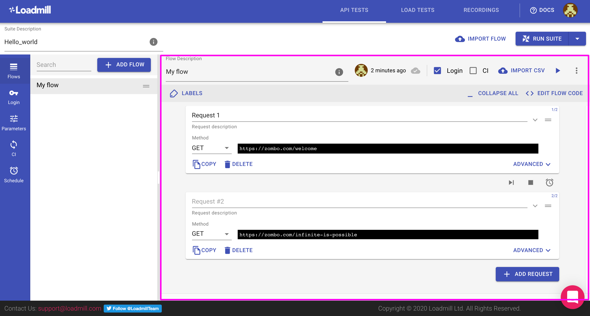
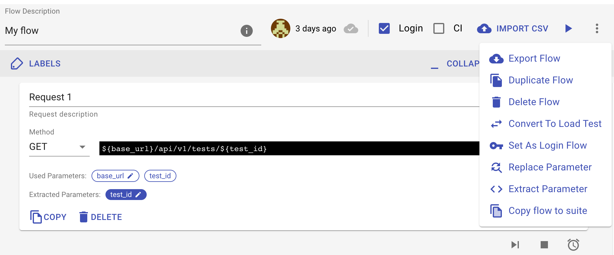
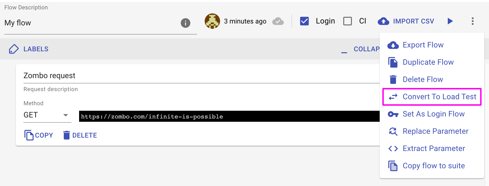
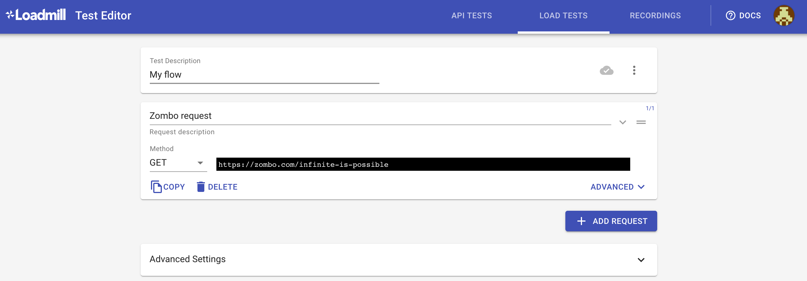
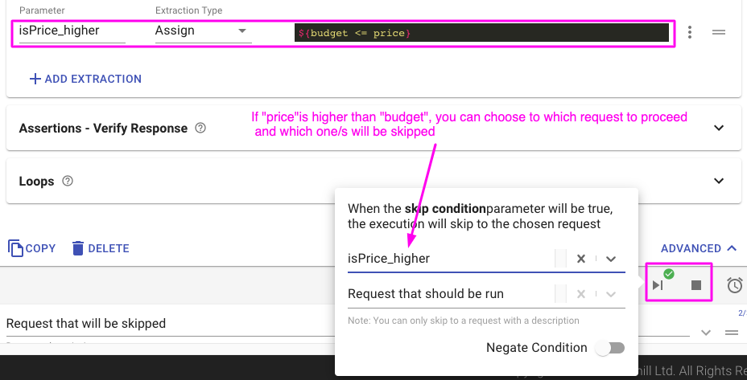

# Test Flow editor

API Test flow is a series of API calls \(HTTP requests\) that represent **a single "user" flow we would like to test**. These requests will be executed sequentially until completion or until the first failure.

### The Test Flow toolbar

#### **Run Flow button** \(▶\)

Run the edited flow as a "Dry run" to debug and validate it.

#### Login toggle

Toggle this switch to enable the flow to use [the Global Login](https://docs.loadmill.com/api-testing/test-suite-editor/global-login-flow) settings.

#### **CI toggle**

Toggle this switch to enable the flow to run when executed from your continuous integration pipeline. You can use our NPM module to execute a Test Suite to test every build in CI, this will be explained lated in [the Integrations section](https://docs.loadmill.com/integrations/npm-modal).

#### Import CSV

Easily re-run your test flows by using different parameters values by uploading a [CSV file](https://docs.loadmill.com/api-testing/test-suite-editor/api-tests-data-from-csv-files) containing a list of the values.

#### **Export Flow**

Save the flow to a `.JSON` file. You can then import the flow into another test suite or as a load test.

#### Duplicate Flow

Create a copy of the original flow within the Test Suite.

#### Delete Flow

Delete the flow.

#### Set As Login Flow

Copy the entire flow to [the Login tab](https://docs.loadmill.com/api-testing/test-suite-editor/global-login-flow). 

#### **Replace Parameter**

Replace the usage of a parameter in this flow with another parameter. \(Find more information about parameters [here](https://docs.loadmill.com/api-testing/test-suite-editor/parameters)\).

#### Extract Parameter

Extract a value to a parameter from all across the test requests.

**Copy flow to suite**

Copy the flow into another Test Suite.

### Other flow controllers

#### **Add Request button**

Add new requests to a flow. Once added you can drag a request to change its order by grabbing it at the top right corner. 

**Converting an API flow to a Load test**

Easily convert an API flow to Load test by clicking on the Flow options menu  located on the top right and select " "Convert to Load Test". Once you've selected "Convert to Load Test", a new Load test will open containing all the requests and properties taken from the original API test.

#### Skip and Stop Condition

Set a skip or stop condition between requests. Let's say you would like to skip "Purchase" Request if the preceding "Get Price" Request response returns a price above the current budget. This could be accomplished by extracting the price to a parameter and setting the Purchase Request skip condition to ${budget &lt;= price}.

