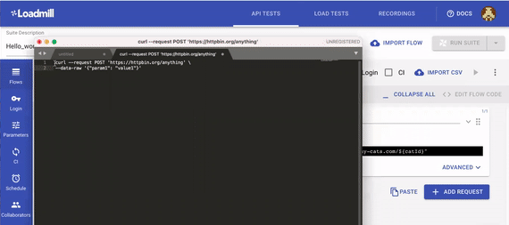
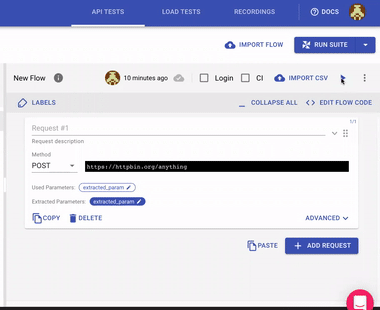

# Import & Export

Loadmill users can import Test Suites, Test Flows, CSV files, Requests, Load Tests and Recordings.

### **Importing Test Suites**

Navigate to API Tests and click "IMPORT SUITE". Make sure your Test Suite in the JSON file format. 

For example, you can use this option to import a collection from Postman. First, export the collection by clicking on three dots within the collection and choosing Collection v2.1 \(recommended\). 

Then, go to Loadmill and import the collection as a Test Suite. Loadmill will automatically recognize Postman data and will create a new Test Suite with test flows and parameters.

### Importing Test Flows and CSV files

To import a test flow, enter a specific Test Suite and click "IMPORT FLOW". Loadmill allows to import test flows in the HAR and JSON file formats. 

You can also use this option to import [HAR files](https://en.wikipedia.org/wiki/HAR_%28file_format%29) generated by the browser's Dev Tools or [Charles proxy](https://www.charlesproxy.com/) \(an HTTP proxy that allows a developer to view all of the HTTP and SSL / HTTPS traffic between their machine and the Internet.\).

Once it's done, you may want to run this or another test flow several times using different parameter values for each run. To achieve that, create a CSV file containing relevant parameters and their values and import it by clicking on "IMPORT CSV" within the test flow. Find more information on that [here](https://docs.loadmill.com/api-testing/test-suite-editor/api-tests-data-from-csv-files). 

### Importing Requests

You can easily paste a cURL command as a request to Loadmill. 


🧠 Make sure you have given permissions to your browser to copy and paste text and images to [the clipboard](https://docs.loadmill.com/general-troubleshooting#it-seems-like-i-cant-paste-requests-within-a-flow). 


### Importing Load Tests and CSV files

Navigate to Load Tests =&gt; Drafts and click "IMPORT TEST". Loadmill allows to import load tests in the HAR and JSON file formats. 

You can also import CSV files into load tests, see how to do that [here](https://docs.loadmill.com/load-testing/working-with-the-test-editor/data-from-csv-files).

### Importing Recordings

In case you are using [GoReplay](https://goreplay.org/) and would like Loadmill to generate an API Test Suite from it, you can import Gor file on the recording page by clicking "IMPORT RECORDING". 

Once it's done, you can click on the "GENERATE TEST SUITE" button within the recording so that a new Test Suite will be created and contain all data from the Gor file.

### Exporting data 

You can export Test Suites, Test Flows, Load Tests, Load Test Run CSV Report and Usage Reports \(team admins only\).

Let's say you have run a test and one of the requests got failed and now you would like to run it separately in the Command Line. To do that, just click on "Copy as cURL" within the failed request.

You can use this option in Test Suite and Load Test Runs as well.

