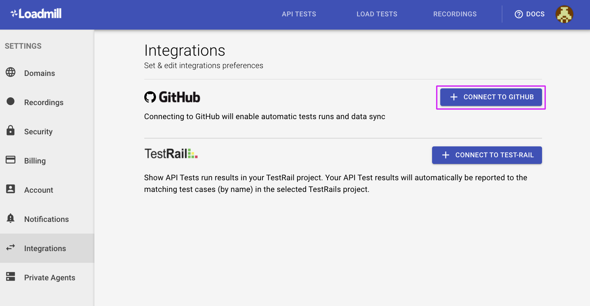
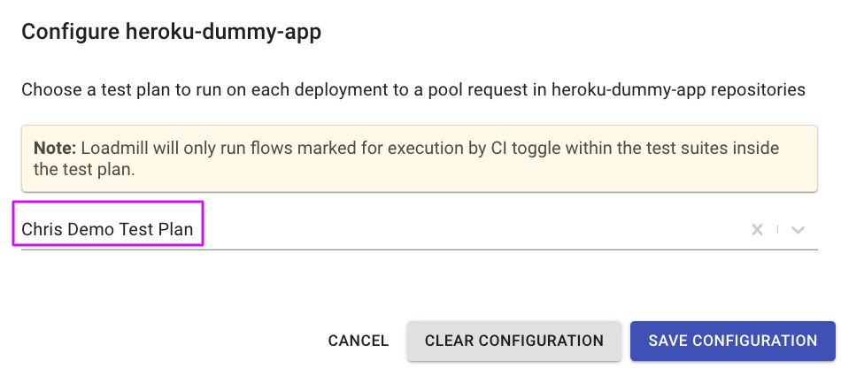

# CI integration

Loadmill allows users to connect tests to a GitHub repository so that the tests will run per each successful release of the application associated with the repository. 

Configure the integration by following the steps below:

1. Navigate to **Settings - Integrations - CONNECT TO GITHUB. **Note: only team admins can perform this action.

    2\. You will promptly be redirected to GitHub and then back to Loadmill, select a relevant repository and click **CONFIGURE**.

     3\. Choose a relevant Test Plan and click **SAVE CONFIGURATION**. Find more information about Test Plans [here](https://docs.loadmill.com/api-testing/test-plan).

From now on, the chosen Test Plan will run upon a successful release to the application associated with the repository with the application url as the target url. 

Watch your tests update in real time on commits and the pull request screen in GitHub as shown below. Click on **Details** to navigate to the Test Plan run.

Each Test Plan run will include the commit message within the Test Suite names:

Thus, it will be easy to identify which commit the Test Plan run is referring to.

To reset the integration, click on **Configured** next to the repository name and click **CLEAR CONFIGURATION**.
