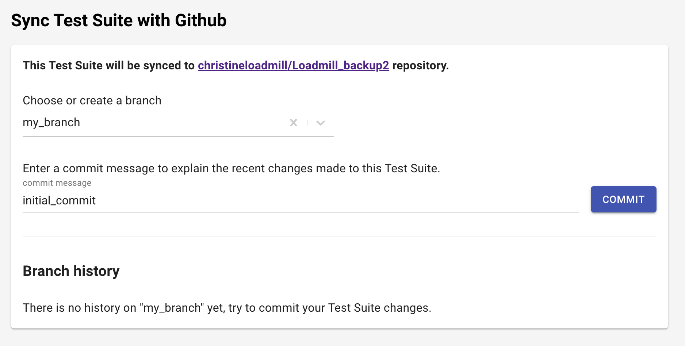
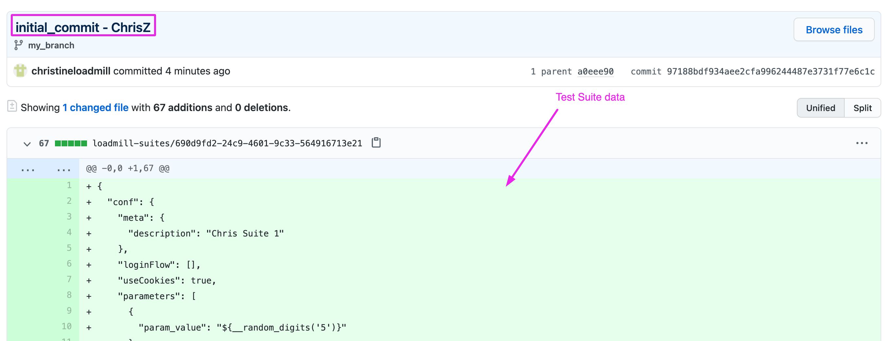
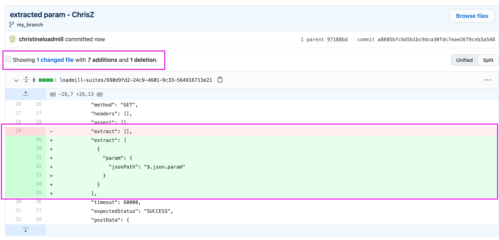
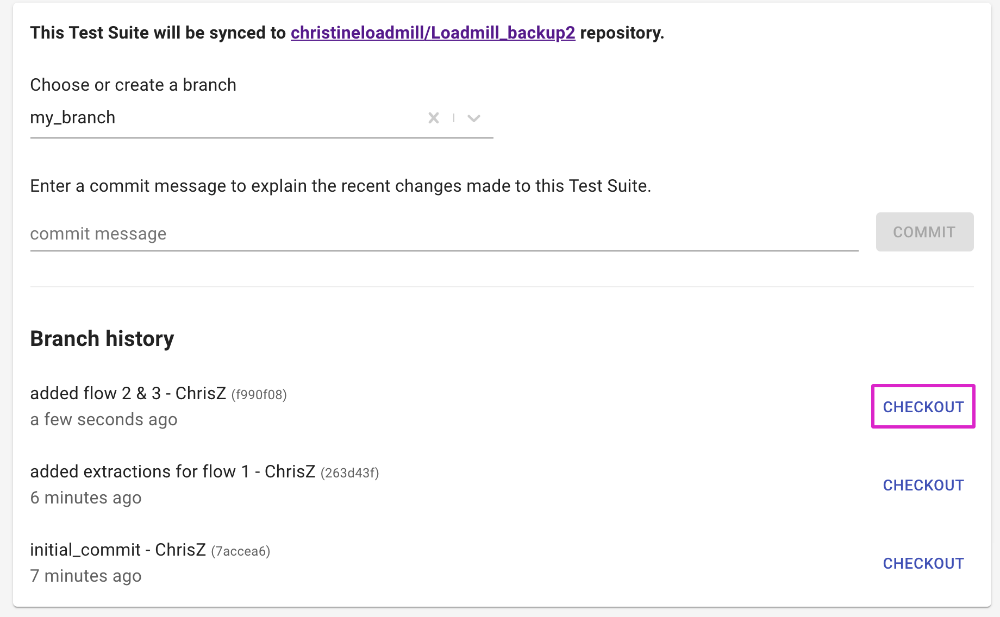

# Data sync connection to GitHub

Loadmill provides the ability to store the Test Suite data in your GitHub repository so you always have a backup when needed. In addition, the data sync connection to GitHub enables you to always track changes made to Test Suites.

### Setup

1. Navigate to **Settings - Integrations - CONNECT TO GITHUB.** Note: only team admins can perform this action.
2. You will promptly be redirected to GitHub and then back to Loadmill, scroll down to the **Setup data sync connection to GitHub** section.
3. Choose a repository to enable data sync to. 

    4. Click on **CONNECT TO REPO.** Now it's time to fill it in with your Test Suite data. 🥳 

### **Usage**

To sync your Test Suite data with your GitHub repository, follow the steps below:

1. Navigate to a relevant Test Suite and click on the **Github sync** tab. 

  2. Choose or create a branch where you would like to sync the Test Suite data to. Then, enter an initial ****commit message and click **COMMIT** to sync the Test Suite data. 

**What happens next?** Loadmill creates the **loadmill-suites** folder in the branch you have selected/created. ****In addition, a new file with the Test Suite data is created in the **loadmill-suites** folder. Its name matches the Test Suite ID. 

Easily navigate to the commit by clicking on **GO TO COMMIT** at the bottom left corner of the screen.

The commit message in GitHub includes your Loadmill username and the commit message you entered in Loadmill. 

**Another great thing about this feature** is that, over time, you can always track changes made to Test Suites. Just remember to enter commit messages to sync the Test Suite changes to GitHub.

Moreover, **you can always revert the Test Suite data to the state of any commit you wish**. Just select it within the Branch history section and click **CHECKOUT**.

To reset the integration, click on **DISCONNECT** within Settings - Integrations - Setup data sync connection to Github.

