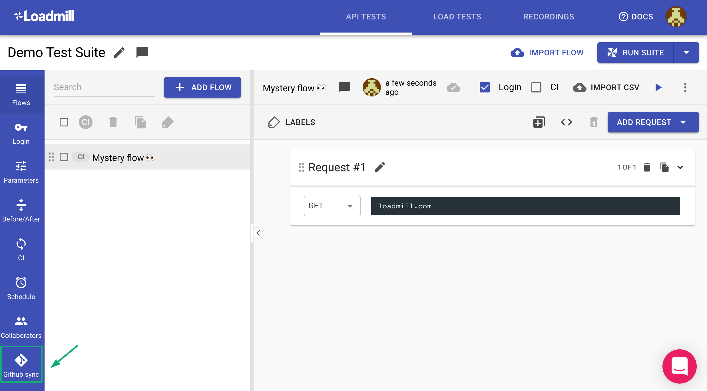
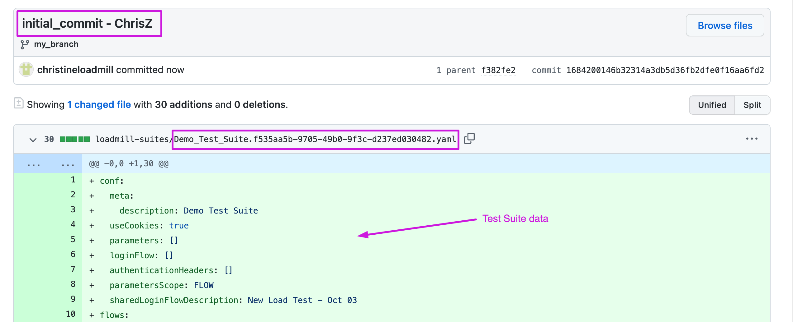
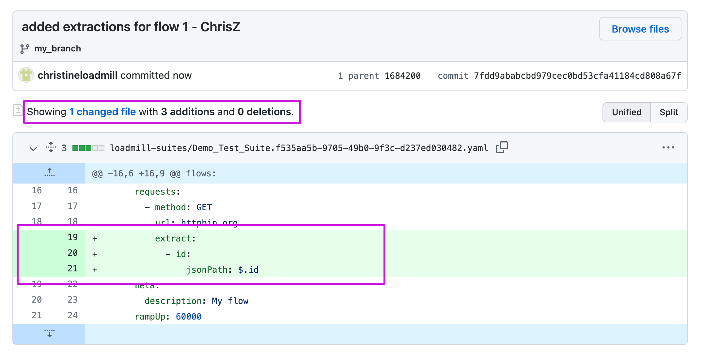
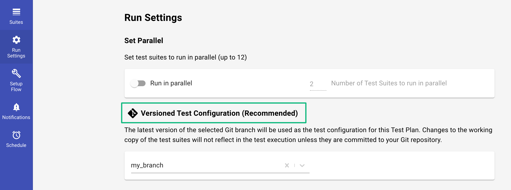

# Data sync

Loadmill provides the ability to store the Test Suite data in your GitHub repository so you always have a backup when needed.&#x20;

In addition, the data sync connection to GitHub enables you to always track changes made to Test Suites and take the data from the repo for test runs.

### Setup

1. Navigate to **Settings** - **Integrations** - **CONNECT TO GITHUB**. Note: only team admins can perform this action.
2. You will promptly be redirected to GitHub and then back to Loadmill, scroll down to the **Setup data sync connection to GitHub** section.
3. Choose a repository to enable data sync to.

&#x20; 4\. Click on **CONNECT TO REPO**. Now it's time to fill it in with your Test Suite data. :partying\_face:

### **Usage**

To sync your Test Suite data with your GitHub repository, follow the steps below:

1. Navigate to a relevant Test Suite and click on the **Github sync** tab.

2\. Choose or create a branch where you would like to sync the Test Suite data to. Then, enter an initial commit message and click COMMIT to sync the Test Suite data.

**What happens next?** Loadmill creates the **loadmill-suites** folder in the branch you have selected/created. In addition, a new file with the Test Suite data is created in the loadmill-suites folder. Its name matches the Test Suite description and ID.

Easily navigate to the commit by clicking on **GO TO COMMIT** at the bottom left corner of the screen.

The commit message in GitHub includes your Loadmill username and the commit message you entered in Loadmill.

**Another great thing about this feature** is that, over time, you can always track changes made to Test Suites. Just remember to enter commit messages to sync the Test Suite changes to GitHub.

Moreover, **you can always revert the Test Suite data to the state of any commit you wish**. Just select it within the Branch history section and click **CHECKOUT**.

### Running Test Plan with the data committed to GitHub

Once you have Test Suite data committed to your GitHub repository, you can select it when running your Test Plan.

Navigate to the **Test Plan** - **Run Settings** - **Versioned Test Configuration (Recommended) **and select the branch where you committed test suite changes to.

Selecting the branch means that the latest version of it with committed changes will be taken as the Test Plan configuration and any other uncommitted test suite changes won't be taken into account.

To reset the integration, click on **DISCONNECT** within Settings - Integrations - Setup data sync connection to Github.
