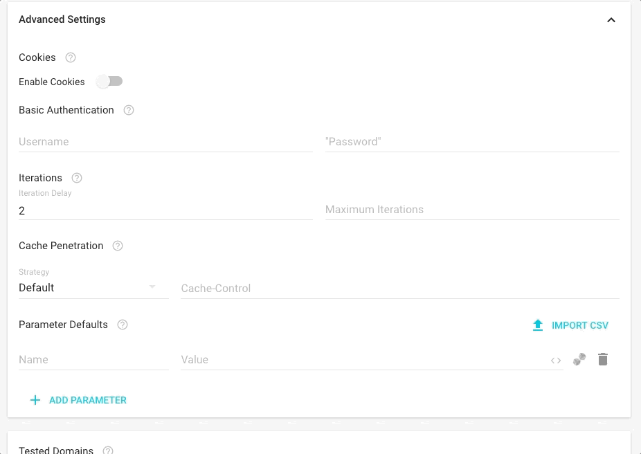
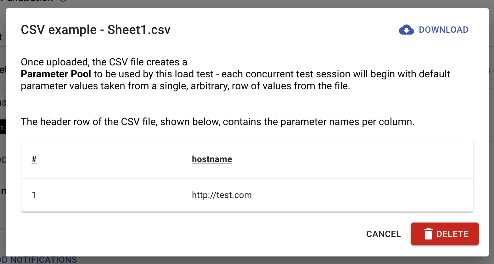

# Data from CSV files

Upload large datasets as CSV files and use them as parameters for you tests. Super fast. Super simple. Find the "Import CSV" in the test  "Advanced Settings" card.

Once the CSV file has been uploaded, you will be able to go over the different parameters and their values in a preview modal, when you're done, just click "Upload". \(Attention: in cases where the CSV file contains empty cells, Loadmill will not prevent its uploading\).

When a test is using a CSV file, there will be an indication in the UI - "Using CSV".

 In order to remove a CSV file from the test, simply click on the "Using CSV" button, and click on the red **DELETE** button.

### Execution Order

When running a test using a CSV file, **a random set of values** will be picked each iteration from one of the CSV lines. When using a parameter defined in CSV file, any giving parameter defined  in the "Default Parameters" section will be overridden by the value given from the CSV file. 

The order of parameter value assignment is: 

1. Value as in the Parameters tab
2. Value as they appear in the CSV file
3. Value as defined in the "Extractions - Set Parameters" section of a specific request \(This will override all of the above\). Find more information about parameter execution order [here](https://docs.loadmill.com/api-testing/test-suite-editor/parameters/parameter-execution-order). 

